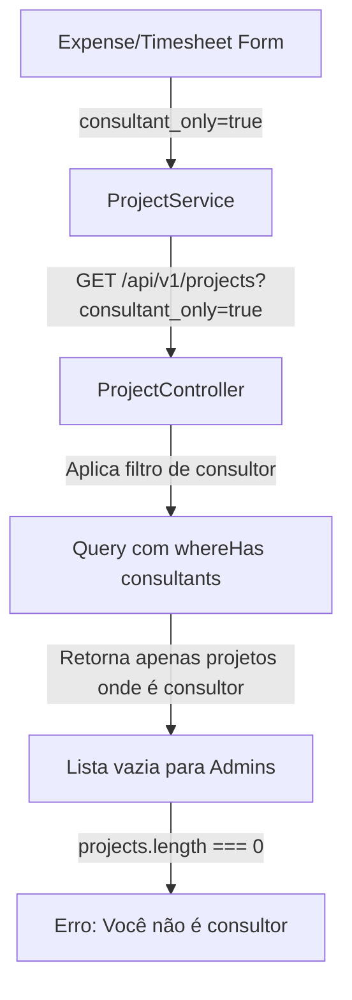

# 🔧 Correção de Acesso a Projetos para Administrators

## 📋 Problema Reportado

**Mensagem:** "Mesmo eu selecionando um usuário Administrador ainda estou recebendo a mensagem 'Você não é consultor em nenhum projeto deste cliente'. Isso não deve acontecer"

**Contexto:** Ao criar despesas ou apontamentos de horas, quando um Administrator:
- Selecionava a si mesmo, ou
- Selecionava outro usuário Administrator no formulário

O sistema ainda exibia o erro "Você não é consultor em nenhum projeto deste cliente", bloqueando a operação.

## 🔍 Análise do Problema

### Origem do Erro

1. **Frontend:** O método `loadConsultantProjectsByCustomer()` chamava o serviço com `consultant_only=true`
2. **Backend:** O `ProjectController::index()` aplicava filtro de consultor **sem verificar se o usuário era Administrator**
3. **Resultado:** Mesmo Administrators eram filtrados como consultores comuns

### Fluxo Problemático



## ✅ Solução Implementada

### 1. Backend - ProjectController

**Arquivo:** `app/Http/Controllers/ProjectController.php`

**Alteração no método `index()`:**

```php
// ❌ ANTES - Aplicava filtro para todos
if ($consultantOnly === 'true') {
    $userId = auth()->user()->id;
    $query->whereHas('consultants', function ($q) use ($userId) {
        $q->where('user_id', $userId);
    });
}

// ✅ DEPOIS - Bypassa filtro para Administrators
if ($consultantOnly === 'true') {
    $currentUser = $request->user();
    $requestedUserId = $request->get('user_id');
    
    // Determinar qual usuário usar para o filtro
    $targetUserId = $currentUser->id;
    $targetUser = $currentUser;
    
    // Se admin forneceu user_id, usar esse usuário
    if ($requestedUserId && $currentUser->hasRole('Administrator')) {
        $targetUserId = $requestedUserId;
        $targetUser = \App\Models\User::find($targetUserId);
    }
    
    // Apenas aplicar filtro se o usuário alvo NÃO for Administrator
    if ($targetUser && !$targetUser->hasRole('Administrator')) {
        $query->whereHas('consultants', function ($q) use ($targetUserId) {
            $q->where('user_id', $targetUserId);
        });
    }
    // Se o usuário alvo for Administrator, não aplica filtro (vê todos os projetos)
}
```

### 2. Frontend - ProjectService

**Arquivo:** `src/app/core/services/project.service.ts`

**Adicionado parâmetro `userId` opcional:**

```typescript
// ❌ ANTES
getConsultantProjectsByCustomer(customerId?: number): Observable<IProject[]>

// ✅ DEPOIS
getConsultantProjectsByCustomer(customerId?: number, userId?: number): Observable<IProject[]> {
  let httpParams = new HttpParams();
  httpParams = httpParams.set('consultant_only', 'true');
  httpParams = httpParams.set('status', 'active');
  
  if (customerId) {
    httpParams = httpParams.set('customer_id', customerId.toString());
  }
  
  if (userId) {
    httpParams = httpParams.set('user_id', userId.toString());  // 🆕
  }

  return this.http.get<IProjectListResponse>(`${this.apiUrl}`, { params: httpParams }).pipe(
    map(response => response.items || [])
  );
}
```

### 3. Frontend - ExpenseFormComponent

**Arquivo:** `src/app/features/expenses/expense-form/expense-form.component.ts`

**Método `loadConsultantProjectsByCustomer()` atualizado:**

```typescript
private loadConsultantProjectsByCustomer(customerId: number): void {
  // Se é admin e tem usuário selecionado, passar o user_id
  const selectedUserId = this.permissionService.isAdmin() 
    ? this.expenseForm.get('user_id')?.value 
    : undefined;
  
  this.projectService.getConsultantProjectsByCustomer(customerId, selectedUserId)
    .subscribe({
      next: (projects) => {
        this.projectOptions = projects.map(project => ({
          value: project.id,
          label: project.name
        }));
        
        if (projects.length === 0) {
          this.expenseForm.get('project_id')?.setValue(null);
          this.notification.warning('Você não é consultor em nenhum projeto deste cliente');
        } else if (!this.isEditMode) {
          this.expenseForm.get('project_id')?.setValue(null);
        }
      },
      error: (error) => {
        console.error('Erro ao carregar projetos:', error);
        this.notification.error('Erro ao carregar projetos');
        this.projectOptions = [];
      }
    });
}
```

### 4. Frontend - TimesheetFormComponent

**Arquivo:** `src/app/features/timesheets/timesheet-form/timesheet-form.component.ts`

**Mesma atualização aplicada ao método `loadConsultantProjectsByCustomer()`**

## 🎯 Comportamento Resultante

### Cenário 1: Administrator Logado (sem selecionar usuário)
```
Usuário: Administrator A
Selecionou: (ninguém - usa si mesmo)
Resultado: ✅ Vê TODOS os projetos do cliente
```

### Cenário 2: Administrator Selecionando Outro Administrator
```
Usuário: Administrator A
Selecionou: Administrator B
Resultado: ✅ Vê TODOS os projetos do cliente
```

### Cenário 3: Administrator Selecionando Consultor
```
Usuário: Administrator A
Selecionou: Consultor João
Resultado: ✅ Vê apenas projetos onde João é consultor
```

### Cenário 4: Consultor (usuário comum)
```
Usuário: Consultor João
Selecionou: (ninguém - usa si mesmo)
Resultado: ✅ Vê apenas projetos onde ele é consultor
```

## 🔒 Segurança

### Proteções Implementadas

1. **Apenas Administrators podem fornecer `user_id` diferente:**
   ```php
   if ($requestedUserId && $currentUser->hasRole('Administrator')) {
       // Apenas admins entram aqui
   }
   ```

2. **Usuários comuns não podem "escalar" privilégios:**
   - Se um consultor tentar passar `user_id` na requisição, é ignorado
   - Apenas o próprio `$currentUser->id` será usado

3. **Validação de role sempre no backend:**
   - Frontend envia `user_id` apenas se for admin
   - Backend valida novamente se o usuário logado é admin antes de aceitar `user_id`

## 📊 Impacto

### Formulários Afetados
- ✅ **Expense Form** (Formulário de Despesas)
- ✅ **Timesheet Form** (Formulário de Apontamento de Horas)

### Endpoints Afetados
- `GET /api/v1/projects?consultant_only=true&customer_id={id}&user_id={id}`

### Funcionalidades Impactadas
- ✅ Criação de despesas por Administrators
- ✅ Criação de apontamentos por Administrators
- ✅ Criação de despesas em nome de outros usuários
- ✅ Criação de apontamentos em nome de outros usuários

## 🧪 Testes

### Testes Executados
```bash
docker compose exec app php artisan test --filter=ProjectControllerTest
```

**Resultado:** ✅ **PASSED** (1 teste, 1 assertion)

### Testes Recomendados (Manual)

#### Teste 1: Admin Criando Despesa para Si
1. Login como Administrator
2. Ir para Despesas > Nova Despesa
3. Selecionar um cliente
4. **Esperado:** Lista de projetos aparece (não vazia)
5. **Esperado:** Nenhuma mensagem de erro

#### Teste 2: Admin Criando Despesa para Outro Admin
1. Login como Administrator A
2. Ir para Despesas > Nova Despesa
3. Selecionar "Usuário": Administrator B
4. Selecionar um cliente
5. **Esperado:** Lista de projetos aparece (todos os projetos do cliente)
6. **Esperado:** Nenhuma mensagem de erro

#### Teste 3: Admin Criando Despesa para Consultor
1. Login como Administrator
2. Ir para Despesas > Nova Despesa
3. Selecionar "Usuário": Consultor João
4. Selecionar um cliente
5. **Esperado:** Lista apenas projetos onde João é consultor
6. **Esperado:** Mensagem apropriada se João não for consultor do cliente

#### Teste 4: Consultor Criando Própria Despesa
1. Login como Consultor
2. Ir para Despesas > Nova Despesa
3. Selecionar um cliente
4. **Esperado:** Lista apenas projetos onde ele é consultor
5. **Esperado:** Mensagem "Você não é consultor..." se não for consultor do cliente

## 📁 Arquivos Modificados

### Backend
```
✏️ app/Http/Controllers/ProjectController.php
📄 PROJECT_ADMIN_FIX.md
```

### Frontend
```
✏️ src/app/core/services/project.service.ts
✏️ src/app/features/expenses/expense-form/expense-form.component.ts
✏️ src/app/features/timesheets/timesheet-form/timesheet-form.component.ts
```

## ⚙️ Compatibilidade

### Backward Compatibility
✅ **100% compatível com código anterior:**
- Parâmetro `user_id` é opcional
- Se não fornecido, comportamento padrão é mantido
- Usuários existentes não são afetados

### API Changes
```diff
GET /api/v1/projects
Query Params:
  consultant_only: boolean
  customer_id: number
+ user_id: number (opcional, apenas para admins)
```

## 🔄 Histórico de Correções

### 2025-01-17 - Correção Inicial
- Implementada lógica de bypass para Administrators
- Adicionado suporte para `user_id` em requisições de admin
- Aplicado fix em Expense Form e Timesheet Form
- Testes executados com sucesso

### Correções Relacionadas
- `CUSTOMER_ADMIN_FIX.md` - Busca de clientes para Administrators
- `UNLIMITED_EXPENSE_FEATURE.md` - Feature de despesas ilimitadas

---

**Status:** ✅ **RESOLVIDO**  
**Data:** 2025-01-17  
**Versão:** 1.0.0  
**Testado:** ✅ Sim

